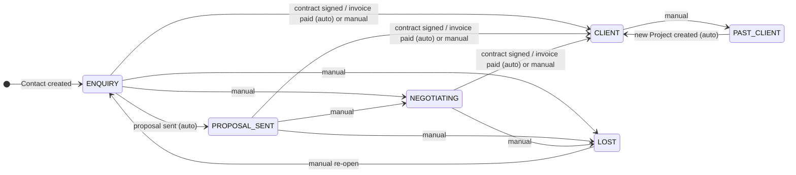
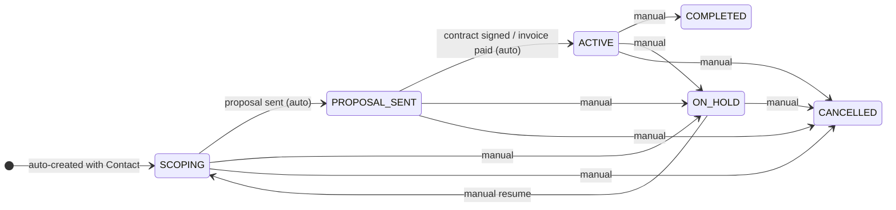

# Unified Contact + Project Model — Requirements

## Summary

Replace the separate `Lead` and `Client` entities with a single **Contact** entity carrying a lifecycle stage. Simultaneously, promote **Project** to the primary unit of work — every operational document (proposal, contract, invoice, expense, time entry, task, attachment) belongs to a Project, never floating loose on a Contact. A default Project is auto-created in `SCOPING` stage whenever a Contact is created, so no document is ever homeless. The pipeline kanban shows Project cards. No Lead→Client conversion step exists anywhere in the product.

---

## Problem Frame

ClearWork has two compounding problems today.

**Problem 1 — split identity.** The same person is modelled as two database records: a `Lead` (pre-sale) and a `Client` (post-sale). Converting a won lead requires a deliberate manual action — a `ConvertLeadDto` API call — that creates a new Client record and optionally creates a Project. After conversion, context fractures: proposals and meetings are on the Lead record, while contracts, invoices, and projects are on the Client record. A freelancer opening a client's detail page sees no negotiation history. A freelancer opening a lead's detail page sees no delivery work. User feedback consistently identifies this conversion step as the #1 friction point in the product.

**Problem 2 — triple-FK document chaos.** Every operational document (Proposal, Contract, Invoice, Expense, TimeEntry, Attachment, Task) currently carries three nullable foreign keys: `leadId`, `clientId`, and `projectId`. There is no enforced rule about which to populate when. A freelancer who invoices "to the client" won't see that invoice when they open the project. A freelancer who attaches a proposal to the project won't see it from the client view. A proposal created during the lead stage (with only `leadId`) becomes invisible once the client is created unless the freelancer manually re-attaches it. The data is systematically fragmented — not because the product was designed badly, but because the Lead/Client split forced documents to exist at two layers with no canonical home.

Both problems share a root cause: the product models the *conversion moment* instead of the *ongoing relationship*.

**The Indian market amplifies both problems.** Indian freelancers heavily use WhatsApp for client communication. They expect a single conversation thread alongside all project work, spanning from first enquiry to delivery and beyond. A model that splits the relationship into Lead/Client records makes a seamless communication view impossible. Additionally, GST compliance in India requires accurate billing details (GST number, state) to be available at invoicing time — which today means those fields only exist post-conversion on the Client record, making it impossible to raise a compliant invoice during negotiation.

---

## Competitor Analysis

Six tools were analysed: Dubsado, HoneyBook, Bonsai, HubSpot, Pipedrive, and FreshBooks. The key axis is: does the tool have an explicit "convert" action, and where do documents live?

### Dubsado (closest model to what ClearWork should become)

Dubsado is entirely Project-centric. When a lead or inquiry comes in, it immediately becomes a Project. There is no separate Lead entity. Project statuses include Lead-type statuses (pre-sale: Inquiry, Proposal Sent, Negotiating) and Job-type statuses (post-sale: Active, Completed). The implicit "conversion" is simply changing the Project's status from a Lead-type to a Job-type. There is no button, no record duplication, no context split. Proposals, contracts, invoices, questionnaires, and all communication live on the same Project throughout. Freelancers widely cite this as the reason they switched to Dubsado — they never lose context.

### HoneyBook

HoneyBook is also Project-centric. All enquiries arrive as Projects. "Tentative" = Project exists but has no signed contract or paid invoice. "Booked" = Project has a signed contract or first payment. "Booked" status is system-computed automatically — there is no "mark as booked" button. All activity flows through the Project. HoneyBook dominates the US photographer/planner/designer market and its no-conversion-step model is frequently cited as a reason for adoption.

### Bonsai

Bonsai takes a hybrid approach: a unified Contact type (tagged as lead, client, or vendor — not separate entities) paired with a separate Deal object that has custom pipeline stages. When a deal is closed, it auto-provisions a project. This is the closest competitor to what ClearWork currently is, but without the manual conversion step. Contact is unified; the deal funnel is separate.

### HubSpot (reference CRM model)

HubSpot uses a unified Contact with a lifecycle stage (Subscriber → Lead → MQL → SQL → Opportunity → Customer → Evangelist). Stage auto-advances when a Deal is associated or when a Deal is closed. Deals are independent pipeline objects — a Contact can have many Deals simultaneously. This is architecturally more powerful (handles agencies/multi-deal-per-client scenarios) but adds cognitive load that solo freelancers find unnecessary.

### Pipedrive (the anti-pattern)

Pipedrive has a dedicated Leads Inbox separate from the pipeline. Converting a lead to a deal requires an explicit "Convert to Deal" button. This is the exact pattern ClearWork currently implements. Pipedrive users on Reddit and ProductHunt consistently describe the Leads → Pipeline boundary as confusing. Pipedrive is the only major CRM that still has an explicit convert button, and it is the most criticised aspect of the product among freelancer users.

### Key takeaways for ClearWork

| Tool | Conversion step? | Pipeline unit | Document home |
|---|---|---|---|
| Dubsado | None | Project | Project |
| HoneyBook | None (auto "Booked") | Project | Project |
| Bonsai | None (deal close auto-provisions) | Deal/Project | Project |
| HubSpot | None (auto-advances on deal) | Deal | Deal |
| Pipedrive | **Yes — explicit button** | Deal | Deal |
| ClearWork (current) | **Yes — manual API call** | Lead (pre) / Project (post) | Lead + Client + Project (split) |

The clear signal: every modern freelancer tool has moved away from explicit conversion. The correct model for ClearWork is Dubsado's approach — Project as the primary unit from first enquiry, Contact as the persistent relationship record.

---

## Key Decisions

**Single Contact entity, stage on Contact.** Contact carries a lifecycle stage spanning the full relationship: `ENQUIRY → PROPOSAL_SENT → NEGOTIATING → CLIENT → PAST_CLIENT`, with `LOST` as an exit from any pre-CLIENT stage. The alternative (Bonsai/HubSpot/Pipedrive model) — a stateless Contact paired with a separate Engagement/Deal entity — handles concurrent deals per client better but adds a second record type that reintroduces "what am I looking at" friction. For ClearWork's solo-freelancer market, concurrent deals with the same client are rare enough that the simpler single-entity model is the right trade-off. Agencies with concurrent multi-deal clients can be served with a future Engagement layer that plugs into this model without breaking it.

**WON stage eliminated.** Winning a deal advances the Contact directly to `CLIENT`. A separate WON stage has no actionable difference from CLIENT — it only adds a manual step with no triggered behaviour.

**PAST_CLIENT is a stage, not an archive.** Past clients remain visible in the Clients view under a collapsible "Past" section. Searchable, re-engageable without any restore step. The `archivedAt` field is preserved separately for truly hiding a record from all views.

**`isDeleted` boolean eliminated.** Lead currently has an `isDeleted` boolean. This is replaced entirely by `archivedAt` (timestamp). A null `archivedAt` means visible; a non-null value means hidden from default views. No boolean soft-delete field exists on Contact.

**Project is the primary unit of work.** All operational documents (proposals, contracts, invoices, expenses, time entries, tasks, task boards, attachments, project notes) belong to a Project — never to a Contact directly. This eliminates the triple-FK ambiguity entirely. A document has one home: its Project.

**Message threads stay at Contact level — the WhatsApp analogy.** Thread (messages) is the single exception to Project-level document ownership. In India, client communication primarily happens on WhatsApp. A freelancer does not start a new WhatsApp chat for each project — they maintain one ongoing conversation thread per contact that spans all projects, from first enquiry to the third engagement two years later. The in-app Thread model mirrors this. Thread belongs to Contact; it is available immediately when a Contact is created, before any Project is scoped, and it persists across all future Projects.

**Auto-create a default Project on Contact creation.** When a Contact is created, a Project in `SCOPING` stage is automatically created alongside it. This means a freelancer can immediately send a proposal, log a meeting, or create a task without a separate setup step. A Contact always has at least one Project. The default Project is named after the Contact's company (or name if no company) until the user renames it.

**Project has a full lifecycle stage.** The current `ProjectStatus` enum (ACTIVE/COMPLETED/ON_HOLD/CANCELLED) covers only post-sale states — projects can only be created after a Client exists. The new stage model covers the full engagement arc: `SCOPING → PROPOSAL_SENT → ACTIVE → COMPLETED`, with `ON_HOLD` and `CANCELLED` as side-exits from any stage. Project stage and Contact stage are independent but linked: specific Project events trigger Contact auto-advances.

**Pipeline kanban shows Project cards, not Contact cards.** Freelancers think in projects ("the Sharma website") not people ("Sharma"). When asked "what are you working on?" they name projects. The pipeline card is the Project; the Contact name appears on the card as a secondary label. This also handles repeat clients naturally — a second enquiry from an existing client creates a new Project card in the pipeline without touching the Contact's `CLIENT` stage.

**Meetings attach to Contact with optional Project reference.** Meetings are relationship-level touchpoints (unlike proposals or invoices which are project-specific). A discovery call with a new lead is a Contact-level event. A project kickoff or sprint review is a project-specific event. Rather than force a choice, Meeting has `contactId` (required) and `projectId` (optional). This matches the current reality where meetings exist at both levels.

**Lead acquisition modules stay separate.** `discovered-leads`, `lead-campaigns`, `lead-vault`, and `leads-proxy` remain architecturally separate for this sprint. Qualifying a discovered lead will promote it to a Contact in `ENQUIRY` stage (with auto-created SCOPING Project). Full integration of the acquisition modules with the Contact entity is deferred.

---

## Current Schema State (AS-IS)

This section documents the current Prisma schema state that this change supersedes. Planning teams should treat this as the migration baseline.

### Lead model (to be eliminated)

```
Lead {
  id           String
  userId       String
  name         String
  email        String?
  phone        String?
  company      String?
  stage        LeadStage   -- ENQUIRY | PROPOSAL_SENT | NEGOTIATING | WON | LOST
  service      String?
  budget       Float?
  source       String?
  followUpAt   DateTime?
  lastActivityAt DateTime?
  clientId     String?     -- set after WON conversion; FK to Client
  isDeleted    Boolean     -- soft delete flag (to be eliminated)
  createdAt    DateTime
  updatedAt    DateTime
  -- relations: proposals (many), meetings (many)
}
```

### Client model (to be eliminated)

```
Client {
  id              String
  userId          String
  name            String
  email           String?
  phone           String?
  company         String?
  gstNumber       String?
  state           String?
  portalToken     String    @unique
  clickupMemberId String?
  createdAt       DateTime
  updatedAt       DateTime
  -- relations: proposals, contracts, invoices, meetings,
  --            timeEntries, expenses, projects, attachments,
  --            notes (ClientNote), threads
}
```

**Client creation is currently rate-limited by plan tier:**
- FREE plan: max 5 clients
- SOLO plan: max 25 clients
- STUDIO plan: unlimited

These limits must migrate to Contact creation limits.

### Project model (to be extended, not replaced)

```
Project {
  id                 String
  clientId           String          -- FK to Client (to become contactId → Contact)
  name               String
  status             ProjectStatus   -- ACTIVE | COMPLETED | ON_HOLD | CANCELLED
  budget             Float?
  startDate          DateTime?
  endDate            DateTime?
  shareRateWithClient Boolean
  clickupListId      String?
  createdAt          DateTime
  updatedAt          DateTime
  -- relations: contracts, invoices, expenses, timeEntries,
  --            attachments, notes (ProjectNote), tasks, taskBoards
}
```

The `status` enum becomes a `stage` enum with pre-sale states added.

### Documents with triple-FK (current chaos)

| Model | leadId | clientId | projectId | Notes |
|---|---|---|---|---|
| Proposal | nullable | nullable | nullable | Can exist on lead, client, or project |
| Meeting | nullable | nullable | — | No projectId today |
| Contract | — | nullable | nullable | |
| Invoice | — | nullable | nullable | |
| Expense | — | nullable | nullable | |
| TimeEntry | — | nullable | nullable | |
| Attachment | — | nullable | nullable | |
| Task | — | nullable | nullable | |
| TaskBoard | — | nullable | nullable | |

**After this change:** all documents except Thread and Meeting have a required `projectId` and no `leadId` or `clientId`.

### Notes models (two separate models today)

- `ProjectNote`: `projectId` required, no `clientId`
- `ClientNote`: `clientId` required, no `projectId`

These need consolidation. Planning must decide: merge into one `Note` model with a nullable `projectId` and nullable `contactId`, or keep two tables. The current split means a "note about the client relationship" and a "note about the project" are in different places, and Contact detail page needs to query both.

### Thread model

```
Thread {
  clientId  String  -- REQUIRED, non-nullable
  -- no projectId
}
```

The `clientId` is non-nullable today. Migration must rename this column to `contactId` with the corresponding Contact FK.

### ConvertLeadDto (to be deleted)

```typescript
// src/modules/leads/dto/convert-lead.dto.ts
class ConvertLeadDto {
  name?: string
  email?: string
  phone?: string
  company?: string
  createProject?: boolean
  projectName?: string
  projectBudget?: number
  projectStartDate?: Date
  projectEndDate?: Date
}
```

This DTO and the endpoint that consumes it are deleted in their entirety. There is no conversion concept in the new model.

### Contact module namespace conflict

`src/modules/contact/contact.service.ts` currently implements a **support email form** — it sends enquiry emails to `hello@getclearwork.in` via nodemailer. It is not a CRM entity. This module must be renamed (e.g., to `src/modules/support-contact/`) before the new Contact CRM entity is created in `src/modules/contacts/`.

---

## Requirements

### Contact entity fields

- R1. A Contact record represents a single person or company and persists as one record from first enquiry through all future engagements.
- R2. Contact carries identity fields from both Lead and Client:
  - From Lead: `name`, `email`, `phone`, `company`, `source`, `service` (service interest), `budget` (deal value), `followUpAt`, `lastActivityAt`
  - From Client: `gstNumber`, `state`, `portalToken` (unique per workspace), `clickupMemberId`
  - New: `stage` (ContactStage enum), `archivedAt` (nullable timestamp)
- R3. Contact has exactly one lifecycle stage at any time, drawn from: `ENQUIRY`, `PROPOSAL_SENT`, `NEGOTIATING`, `CLIENT`, `PAST_CLIENT`, `LOST`.
- R4. `LOST` is reachable from any pre-CLIENT stage. A lost contact can be manually re-opened, returning to `ENQUIRY`. All Project and document history is preserved.
- R5. Contact has an `archivedAt` timestamp field. A non-null `archivedAt` hides the Contact from all default views. Archiving is independent of lifecycle stage — a PAST_CLIENT contact can be archived; an archived contact retains its stage.
- R6. The `isDeleted` boolean (from Lead) does not exist on Contact. Soft-deletion is exclusively via `archivedAt`.
- R7. Contact creation is rate-limited by workspace plan tier, inheriting the current Client limits: FREE plan max 5, SOLO plan max 25, STUDIO plan unlimited.

### Contact stage transitions

- R8. Contact auto-advances from `ENQUIRY` to `PROPOSAL_SENT` when a proposal within any of its Projects is sent. A proposal sent when the Contact is in any stage other than `ENQUIRY` does not change the Contact's stage.
- R9. Contact auto-advances from any pre-CLIENT stage to `CLIENT` when a contract within any of its Projects is signed, or when an invoice within any of its Projects receives its first payment.
- R10. Auto-advance to `CLIENT` is suppressed when the Contact is already in `CLIENT` or `PAST_CLIENT` — document events on existing clients do not trigger stage changes.
- R11. All other Contact stage transitions are manual:
  - `ENQUIRY → NEGOTIATING`
  - `PROPOSAL_SENT → NEGOTIATING`
  - any pre-CLIENT → `LOST`
  - `CLIENT → PAST_CLIENT`
  - `PAST_CLIENT → CLIENT` (also triggered automatically by new Project creation per R18)
- R12. A user can manually promote a Contact to `CLIENT` from any pre-CLIENT stage without requiring a document event.

### Project entity

- R13. A Project represents a single scoped engagement. A Project can be created on a Contact at any Contact lifecycle stage, including `ENQUIRY`.
- R14. When a Contact is created, a default Project in `SCOPING` stage is automatically created alongside it. The default Project name is the Contact's company name, or the Contact's name if no company is set.
- R15. A Contact always has at least one Project. Attempting to delete the last Project on a Contact is blocked with a validation error.
- R16. Project has a `stage` field (replacing the current `status` field) with values: `SCOPING`, `PROPOSAL_SENT`, `ACTIVE`, `COMPLETED`, `ON_HOLD`, `CANCELLED`. The transition model is:
  - Primary path: `SCOPING → PROPOSAL_SENT → ACTIVE → COMPLETED`
  - Side-exits: any stage → `ON_HOLD` or `CANCELLED`
  - Re-entry: `ON_HOLD → SCOPING` (or prior stage) as a manual action
- R17. Project retains existing fields: `name`, `budget`, `startDate`, `endDate`, `shareRateWithClient`, `clickupListId`.
- R18. Project replaces `clientId` with `contactId` (FK to Contact).
- R19. Project auto-advances from `SCOPING` to `PROPOSAL_SENT` when a proposal within that Project is sent. A proposal sent when the Project is in any stage other than `SCOPING` does not change the Project's stage.
- R20. Project auto-advances to `ACTIVE` when a contract within that Project is signed, or when an invoice within that Project receives its first payment. This simultaneously triggers the Contact auto-advance to `CLIENT` per R9, subject to the R10 guard.
- R21. A repeat client (Contact in `CLIENT` stage) gets a new Project created directly from the Contact detail page. The Contact's stage stays `CLIENT`. A new pipeline card appears for the new Project in `SCOPING`.
- R22. Creating a new Project on a `PAST_CLIENT`-stage Contact automatically advances the Contact to `CLIENT`.

### Document attachment rules

- R23. Proposals, contracts, invoices, expenses, time entries, tasks, task boards, attachments, and project notes must always belong to a Project. The `leadId` and `clientId` FKs on these models are dropped. `projectId` becomes required (non-nullable).
- R24. Message threads (Thread) belong to Contact. `clientId` is renamed to `contactId`. Thread does not have a `projectId`. A Thread is available on a Contact from the moment the Contact is created, before any Project is scoped.
- R25. Meetings belong to Contact (`contactId` required). Meetings have an optional `projectId` for project-specific meetings (kickoffs, reviews, client calls). Deleting a Project sets `projectId` to null on linked meetings (SET NULL); meetings are not deleted when a Project is deleted.
- R26. Notes: `ProjectNote` (anchored to Project) and `ClientNote` (anchored to Client, migrated to Contact) both persist. Planning must decide whether to merge into a single `Note` model or keep separate tables. Either way, Contact detail page renders both.

### Views

- R27. **Pipeline view** — kanban board showing Project cards. Displays Projects in `SCOPING` and `PROPOSAL_SENT` stages. Each card shows: Project name (primary), Contact name (secondary), deal value (from `Project.budget` or `Contact.budget`), and time in stage. Contacts in `NEGOTIATING` stage do not appear as a kanban column by default — they appear in a collapsible sidebar list within the Pipeline view.
- R28. **Clients view** — list of Contacts in `CLIENT` and `PAST_CLIENT` stages. Each Contact row expands to show its `ACTIVE` Projects inline. `PAST_CLIENT` contacts are grouped under a collapsible "Past clients" section at the bottom.
- R29. **All Contacts view** — shows every non-archived Contact regardless of stage. Filterable by stage, source, service, and search. Replaces the current split between Leads list and Clients list.
- R30. **Contact detail page** — single page showing the full lifecycle of a Contact, structured as:
  1. Contact identity block (name, company, email, phone, GST number, state, source, stage badge)
  2. Pipeline fields block (deal value, service interest, follow-up date, last activity)
  3. Message thread (Thread) — full conversation history, always visible
  4. Projects list — all Projects ordered by recency, each expandable to show its proposals, contracts, invoices, tasks, time entries, expenses, and attachments
  5. Meetings — all meetings for this Contact (with Project label where linked)

### Portal access

- R31. The portal access token lives on Contact. A Contact in any stage can have a portal link shared with them — the portal is not gated to `CLIENT` stage. The `portalToken` value is unique per workspace (migrated from Client, same uniqueness constraint).
- R32. Existing portal URLs must remain functional after migration. The portal router must resolve `portalToken → Contact` (previously `portalToken → Client`).

### Pipeline value aggregation

- R33. The pipeline value metric (displayed in dashboard/reports) currently aggregates `Lead.budget` for leads where stage is not `WON` or `LOST`. After migration, this aggregates `Project.budget` (or `Contact.budget` as fallback) for Projects where stage is `SCOPING` or `PROPOSAL_SENT`. The exact field used (Project.budget vs Contact.budget) is deferred to planning — the requirement is that the metric continues to reflect in-flight deal value.

### Data migration

- R34. Every existing Lead record that has no `clientId` becomes a Contact with its current stage preserved. `WON`-stage Leads (no `clientId`) become Contacts in `CLIENT` stage.
- R35. Every existing Client record that no Lead links to (i.e., no Lead has this Client's ID as `clientId`) becomes a Contact in `CLIENT` stage.
- R36. When a Lead has `clientId` set (was manually converted), the Lead and Client merge into one Contact. Merge rules:
  - Contact name, email, phone, company: take Client's values (more recently updated, post-conversion)
  - `gstNumber`, `state`, `portalToken`, `clickupMemberId`: from Client (billing fields)
  - `source`, `service`, `budget`, `followUpAt`, `lastActivityAt`: from Lead (pipeline fields)
  - Stage: `CLIENT` (the contact was already won)
- R37. All document FKs that point to a Lead are replaced with `projectId` pointing to the primary Project of the corresponding Contact. For Proposals that already have a `projectId`, that projectId is retained.
- R38. All document FKs that point to a Client (where no Project FK exists) are replaced with `projectId` pointing to the primary Project of the corresponding Contact.
- R39. Existing Threads (`clientId`) are migrated to `contactId` pointing to the corresponding Contact. No `projectId` is assigned.
- R40. For each migrated Contact that has no pre-existing Project, a `SCOPING`-stage Project is auto-created to receive any orphaned documents.
- R41. For each migrated Contact that has pre-existing Projects (from the old Client), those Projects have their `clientId` replaced with `contactId`. The oldest Project becomes the primary Project.
- R42. Meetings that have both `leadId` and `clientId` — after merge these point to the same Contact. Both FKs are collapsed into a single `contactId`.

### Module and code cleanup

- R43. `src/modules/contact/` (support email form) is renamed to `src/modules/support-contact/` (or equivalent) before the new Contact CRM module is created.
- R44. `src/modules/leads/dto/convert-lead.dto.ts` and the `convertLead` endpoint/service method are deleted. There is no conversion concept.
- R45. `LeadStage` enum is deleted. A new `ContactStage` enum replaces it with values: `ENQUIRY`, `PROPOSAL_SENT`, `NEGOTIATING`, `CLIENT`, `PAST_CLIENT`, `LOST`.
- R46. `ProjectStatus` enum is deleted. A new `ProjectStage` enum replaces it with values: `SCOPING`, `PROPOSAL_SENT`, `ACTIVE`, `COMPLETED`, `ON_HOLD`, `CANCELLED`.

---

## Key Flows

### Contact lifecycle state machine



### Project lifecycle state machine



### F1 — New contact, full enquiry-to-client arc

- **Trigger:** Freelancer adds a new contact manually (e.g., from an inbound WhatsApp enquiry).
- **Steps:** Contact created in `ENQUIRY`. Default Project auto-created in `SCOPING`, named after the Contact. Freelancer chats via Thread immediately — no project setup needed. Freelancer scopes work, renames the Project, sends a proposal → Project advances to `PROPOSAL_SENT`, Contact advances to `PROPOSAL_SENT`. Client signs the contract → Project advances to `ACTIVE`, Contact advances to `CLIENT`. All history (chat, proposal, contract, invoices, time entries) is visible on the single Contact detail page.
- **Covers:** R1, R3, R8, R9, R13, R14, R16, R19, R20, R23, R24, R30

### F2 — Existing client, new engagement

- **Trigger:** A `CLIENT`-stage Contact messages the freelancer about a new piece of work.
- **Steps:** Freelancer opens the Contact. Thread shows the existing conversation alongside all past project history. Freelancer clicks "New Project" on the Contact detail page. New Project created in `SCOPING`. A new card appears in the Pipeline view. Contact stage stays `CLIENT`. All proposals, contracts, and invoices for the new engagement attach to the new Project.
- **Covers:** R21, R27, R30

### F3 — Re-engaging a past client

- **Trigger:** A `PAST_CLIENT` Contact messages about new work.
- **Steps:** Freelancer creates a new Project on the Contact. Contact stage auto-advances to `CLIENT`. Contact moves from the "Past clients" section of Clients view into the active section. Full relationship history (all past Projects) remains visible.
- **Covers:** R22, R28

### F4 — Lost contact re-opened

- **Trigger:** A `LOST` Contact gets back in touch after a gap.
- **Steps:** Freelancer manually sets the Contact stage back to `ENQUIRY`. All prior Projects remain visible in history (in `CANCELLED` stage). Freelancer either revives an existing Project or creates a new one. The Thread shows the full conversation history including the period before the relationship went cold.
- **Covers:** R4, R30

### F5 — Message before any project is scoped

- **Trigger:** New Contact created from an inbound enquiry; freelancer wants to reply before any scoping.
- **Steps:** Contact created. Thread is available immediately. Freelancer replies in-app. When ready to scope, freelancer renames the auto-created SCOPING Project and begins attaching a proposal to it.
- **Covers:** R14, R24

### F6 — Discovered lead qualified to Contact

- **Trigger:** Freelancer qualifies a lead from the `discovered-leads` module.
- **Steps:** Freelancer clicks "Add to Contacts" on a discovered lead. Contact created in `ENQUIRY`. Default Project auto-created in `SCOPING`. Discovered lead record is marked as qualified and linked to the new Contact.
- **Covers:** R13, R14; acquisition module integration deferred to separate sprint.

---

## Acceptance Examples

- AE1. **R8, R10 — Contact stage guard on proposal send**
  - **Given:** A Contact is in `CLIENT` stage. It has two Projects.
  - **When:** The freelancer sends a new proposal within the second Project.
  - **Then:** The proposal attaches to the second Project (now in `PROPOSAL_SENT`). The Contact's stage remains `CLIENT`.

- AE2. **R20, R9 — Project and Contact advance together on contract sign**
  - **Given:** A Contact is in `PROPOSAL_SENT` stage. Its Project is in `PROPOSAL_SENT`.
  - **When:** The client signs the contract attached to that Project.
  - **Then:** The Project advances to `ACTIVE`. The Contact advances to `CLIENT`. Both are automatic.

- AE3. **R36 — Lead+Client merge on migration**
  - **Given:** Lead record has `clientId` set (was manually converted). The Lead has two proposals attached. The Client has one contract and one invoice attached.
  - **When:** Migration runs.
  - **Then:** One Contact record exists with the Client's billing fields and the Lead's pipeline fields. The two proposals, the contract, and the invoice are all attached to the Contact's primary Project.

- AE4. **R4 — Lost contact history preserved on re-open**
  - **Given:** Contact is `LOST`. Its Project is `CANCELLED` with two prior proposals.
  - **When:** Freelancer manually re-opens the Contact to `ENQUIRY`.
  - **Then:** Contact returns to `ENQUIRY`. The cancelled Project and its proposals remain visible in the Contact's history. Thread conversation history is fully intact.

- AE5. **R28 — PAST_CLIENT is visible in Clients view**
  - **Given:** A Contact is in `PAST_CLIENT` stage.
  - **When:** User opens Clients view.
  - **Then:** The Contact appears under a collapsible "Past clients" section. No extra filter toggle needed.

- AE6. **R15 — Last Project deletion blocked**
  - **Given:** A Contact has exactly one Project.
  - **When:** Freelancer attempts to delete that Project.
  - **Then:** The delete is rejected with a validation error: "A contact must always have at least one project."

- AE7. **R27 — Pipeline shows Project cards, not Contact cards**
  - **Given:** Contact "Rahul Sharma" is in `PROPOSAL_SENT`. Their Project "Sharma Website Redesign" is in `PROPOSAL_SENT`.
  - **When:** Freelancer opens Pipeline view.
  - **Then:** A card titled "Sharma Website Redesign" appears in the `PROPOSAL_SENT` column. "Rahul Sharma" is a secondary label on the card. No separate card exists for the Contact.

- AE8. **R22 — New Project on PAST_CLIENT auto-advances Contact**
  - **Given:** Contact is `PAST_CLIENT`.
  - **When:** Freelancer creates a new Project on the Contact.
  - **Then:** Contact stage advances to `CLIENT` automatically. The new Project starts in `SCOPING`.

- AE9. **R25 — Meeting Project reference nullified on Project delete**
  - **Given:** A Meeting is linked to Contact "Priya Patel" and Project "Brand Identity".
  - **When:** The Project "Brand Identity" is deleted.
  - **Then:** The Meeting remains, still linked to the Contact. `projectId` on the Meeting is set to null. The Meeting appears in the Contact detail page's meetings section without a project label.

- AE10. **R24 — Thread available before project is named**
  - **Given:** A Contact was just created. The auto-created SCOPING Project is still named "Priya Patel" (default name, not yet renamed).
  - **When:** Freelancer opens the Contact detail page and clicks the Thread tab.
  - **Then:** The Thread is available and the freelancer can send a message. No project setup is required.

---

## Scope Boundaries

**Deferred for later:**
- Engagement/Deal entity for agencies managing multiple concurrent deals with the same Contact. The current model does not block this — a future sprint can add an Engagement layer that sits between Contact and Project without breaking either.
- Full integration of `discovered-leads`, `lead-campaigns`, `lead-vault`, `leads-proxy` with the new Contact entity. For now, qualifying a discovered lead creates a Contact in `ENQUIRY` with an auto-created SCOPING Project.
- Automation rules triggered by Contact or Project stage changes (auto-send welcome message on `CLIENT`, auto-archive after 90 days in `PAST_CLIENT`, etc.).
- Bulk stage editing from Pipeline or Clients view.
- `NEGOTIATING` as a visible kanban column in Pipeline. For now, NEGOTIATING contacts appear in a collapsible sidebar list within the Pipeline view. This can be promoted to a full kanban column in a later sprint.
- Project templates — predefined task lists, invoice schedules, or contract templates attached to a Project type.

**Out of scope:**
- Company/Organization as a separate entity type (B2B org-chart: one Company → many Contacts). Company fields live on Contact.
- Lead scoring or AI-based contact prioritisation.
- Multi-currency support. ClearWork is INR-only.
- SMS/WhatsApp outbound send from within Thread. Thread is in-app messaging; outbound WhatsApp integration is a separate feature.

---

## Dependencies / Assumptions

- `src/modules/contact/` (support email form) must be renamed before the new Contact CRM module is created. The rename must happen in a separate commit to avoid history confusion.
- Email uniqueness is assumed to be unenforced today on Lead and Client. Before migration runs, a deduplication report must identify contacts with the same email within a workspace. Strategy for duplicate resolution (merge, keep both, prompt user) is deferred to planning.
- `archivedAt` replaces `isDeleted`. Planning must confirm no application code reads `isDeleted` for any purpose other than filtering archived records, before the field is dropped.
- The portal token must remain unique per workspace. The uniqueness constraint on `portalToken` moves from the Client table to the Contact table unchanged. Existing portal URLs (e.g., `clearwork.in/portal?token=abc123`) must continue to resolve after migration.
- `ClientNote` and `ProjectNote` are separate models today. Planning must decide: merge into one `Note` model with nullable `contactId` and `projectId`, or keep two tables and render both on Contact detail page via a union query. Either is acceptable; the decision affects the migration script.
- Thread has `clientId String` (required, non-nullable) today. The migration renames this column to `contactId` and updates the FK reference. This is a breaking schema change and must be gated behind a deploy with backward compatibility if any external consumer reads the Thread table directly.
- Project's `clientId` becomes `contactId`. This is a column rename + FK change. The Prisma migration must handle this as a rename, not a drop-and-add, to preserve data.
- Pipeline value aggregation logic in `leads.service.ts` (currently `SUM(budget) WHERE stage NOT IN ('WON','LOST')`) must be rewritten to query `Project.budget` or `Contact.budget` for Projects in `SCOPING`/`PROPOSAL_SENT`. The field to sum (Project vs Contact) is confirmed at planning time.

---

## Outstanding Questions

**Deferred to planning — no blocker on requirements:**
- Exact deduplication strategy for contacts with the same email within a workspace (merge, keep newest, prompt user).
- Whether pipeline value sums `Project.budget` or `Contact.budget` for in-flight projects.
- Whether `NEGOTIATING` contacts with active Projects appear only in the sidebar list, or also as a semi-transparent column in the kanban.
- Whether `ClientNote` and `ProjectNote` merge into one `Note` model or remain as two tables.
- Whether `Meeting.projectId` is a Prisma FK relation (with SET NULL on delete) or a loose UUID string tag. The FK relation is recommended but has implications for the migration script.
- Whether the `clickupMemberId` uniqueness constraint on Client (one ClickUp member per workspace) is enforced at the DB level or application level, and how it migrates to Contact.
- How the `portalToken` column rename handles in-flight portal sessions at deploy time.

---

## Sources

### Competitor research (verified)

- **Dubsado** — Project-centric from first inquiry. Lead-type and Job-type are statuses on a Project, not separate entities. No conversion button. Source: `help.dubsado.com/en/articles/12856226-the-projects-page`, `help.dubsado.com/en/articles/13554205-project-statuses`.
- **HoneyBook** — Project-centric. "Tentative" and "Booked" are system-computed statuses on a Project based on document state. No conversion action. Source: `help.honeybook.com/en/articles/2641806-honeybook-beginners-glossary`, `help.honeybook.com/en/articles/9586140-terms-for-project-management`.
- **Bonsai** — Unified Contact type with tags (lead/client/vendor) + separate Deal pipeline. Closing a deal auto-creates a Project. Source: `hellobonsai.com/crm`, `hellobonsai.com/pipeline`.
- **HubSpot** — Unified Contact with lifecycle stage. Stage auto-advances on Deal events. No manual convert action. Source: `knowledge.hubspot.com/contacts/use-lifecycle-stages`.
- **Pipedrive** — Leads Inbox separate from pipeline. Explicit "Convert to Deal" button is the conversion step. Consistently the most-criticised aspect of the product in freelancer communities. Source: `support.pipedrive.com/en/article/leads-inbox`.

### Codebase baseline (verified at session start)

- `prisma/schema.prisma` line ~377 — Client model: fields and relations confirmed as documented in Current Schema State above.
- `prisma/schema.prisma` line ~409 — Lead model: `isDeleted` boolean confirmed, `clientId` optional FK confirmed, `stage` enum confirmed.
- `prisma/schema.prisma` line ~440 — `LeadStage` enum: ENQUIRY, PROPOSAL_SENT, NEGOTIATING, WON, LOST.
- `prisma/schema.prisma` line ~452 — Proposal model: `leadId` nullable, `clientId` nullable, `projectId` nullable — triple-FK confirmed.
- `prisma/schema.prisma` line ~676 — Meeting model: `leadId` nullable, `clientId` nullable, no `projectId`.
- `prisma/schema.prisma` line ~832 — Project model: `clientId` only (no `leadId`), `status` enum ACTIVE/COMPLETED/ON_HOLD/CANCELLED, no pre-sale stages.
- `prisma/schema.prisma` line ~949 — Thread model: `clientId String` required and non-nullable, no `projectId`.
- `src/modules/contact/contact.service.ts` — confirmed as support email form sending to `hello@getclearwork.in` via nodemailer; not a CRM entity.
- `src/modules/leads/dto/convert-lead.dto.ts` — ConvertLeadDto confirmed with optional project creation fields.
- `src/modules/clients/clients.service.ts` — plan tier limits (FREE:5, SOLO:25, STUDIO:∞) and `portalToken` generation confirmed.
- `src/modules/leads/leads.service.ts` — `pipelineValue` aggregation from `Lead.budget` WHERE stage NOT IN (WON, LOST) confirmed.
