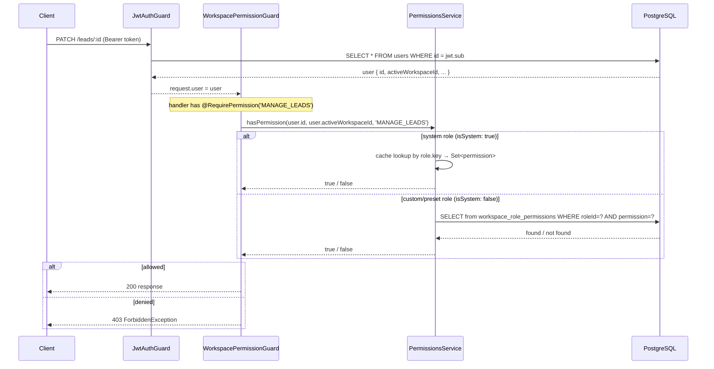

# feat: Complete RBAC Role and Access System

**Date:** 2026-08-31
**Origin:** `docs/brainstorms/2026-08-31-rbac-requirements.md`
**Scope:** pakka-api only — backend schema, API, enforcement, and legacy cleanup. The pakka-app roles settings UI is a separate plan.

---

## Summary

The `WorkspacePermissionGuard` and `@RequirePermission()` decorator are fully wired and registered as global guards, but applied to zero controller endpoints — the API is currently open to any authenticated team member regardless of their role. This plan completes the RBAC system in 8 implementation units: schema migration to support workspace-scoped roles, preset seeding at workspace creation, server-side enforcement across all controllers, a roles CRUD API, invite flow hardening, and retirement of legacy dual-write fields. The column drop for `User.ownerId` is explicitly deferred; the `WorkspaceMember.role` column drop is included as U8.

---

## Problem Frame

Studio plan allows unlimited team members, but enforcement is frontend-only. Any team member can call mutation endpoints directly and bypass the `Can` component gating entirely. Additionally, the `WorkspaceRole` schema has no `workspaceId` column, meaning workspace-scoped custom and preset roles (Designer, Account Manager, Contractor) cannot be created — every role today is a global system role.

**Security gap:** The API is unprotected for team members. This is the highest-priority item in the plan.

---

## Requirements Traceability

From `docs/brainstorms/2026-08-31-rbac-requirements.md`:

- **SC-1** No team member can reach a resource they lack permission for via the API.
- **SC-2** An owner can create a "Contractor" role and invite a user to it; that user receives 403 on mutation endpoints.
- **SC-3** System roles (OWNER/ADMIN/MEMBER/VIEWER) cannot be edited or deleted.
- **SC-4** Preset roles (Designer/Account Manager/Contractor) exist in every new Studio workspace and are editable by the owner.
- **SC-5** The invite flow allows selecting any workspace role, defaulting to MEMBER.
- **SC-6** `LegacyMemberRole` writes are retired; `User.ownerId` writes are removed.

---

## Key Technical Decisions

**KTD-1: Unique constraint strategy for `WorkspaceRole`.**
The current schema has `key String @unique` on `WorkspaceRole`. System roles (`workspaceId = null`) must stay globally unique by key; workspace-scoped roles must be unique per workspace. PostgreSQL's standard unique constraint treats NULLs as distinct — `@@unique([workspaceId, key])` would allow two `(null, 'OWNER')` rows, breaking system role uniqueness. The solution is two partial unique indexes in raw SQL: `UNIQUE(key) WHERE workspace_id IS NULL` for system roles, and `UNIQUE(workspace_id, key) WHERE workspace_id IS NOT NULL` for workspace-scoped roles. Prisma schema documents these with `@@ignore` markers and `// @db.Unique` comments; the raw SQL is in the migration file.

**KTD-2: Preset roles are per-workspace copies, not global templates.**
Designer, Account Manager, and Contractor are seeded as `WorkspaceRole` rows with `isSystem: false` and `workspaceId = <new-workspace-id>` at workspace creation time. Each workspace owns its own mutable copy. System roles (`isSystem: true, workspaceId = null`) remain global. No new enum or flag beyond `isSystem` and `workspaceId` is needed.

**KTD-3: Preset seeding is plan-gated.**
Presets are seeded only when the workspace is on the Studio plan, or when the owner upgrades to Studio. Existing Studio workspaces at the time of deployment get a one-time backfill migration that seeds the preset roles. Solo and Free workspaces get no presets (no team members allowed).

**KTD-4: `workspace.create` endpoint stays unguarded.**
Creating a workspace is a user-level action with no existing workspace context — `user.activeWorkspaceId` is not yet set at that point. The guard short-circuits to `false` when `activeWorkspaceId` is null, so `POST /workspaces` must remain annotation-free (and therefore unguarded via `WorkspacePermissionGuard`). `JwtAuthGuard` still enforces authentication.

**KTD-5: `PermissionsService` in-memory cache covers system roles only.**
Custom and preset roles (`isSystem: false`) always fall through to a DB query in `hasPermission()`. This is acceptable for now. A per-request or short-TTL workspace-role cache is deferred to a follow-up performance pass once real traffic patterns are known.

**KTD-6: `User.ownerId` writes retired; column drop deferred.**
All code writing `User.ownerId` is removed in this plan. The column itself and `User.ownerId` reader paths (auth fallback in `resolveWorkspaceId`) are left in place until a follow-up plan confirms no production row depends on the fallback and safely removes it.

---

## High-Level Technical Design

### Permission Check Flow (post-plan)



### Schema Change — `WorkspaceRole`

```
Before:
  WorkspaceRole { id, key (UNIQUE), name, isSystem, sortOrder, permissions[], members[] }

After:
  WorkspaceRole { id, key, workspaceId?, name, isSystem, sortOrder, permissions[], members[], workspace? }
  
  Partial unique indexes (raw SQL):
    CREATE UNIQUE INDEX workspace_roles_key_system_unique
      ON workspace_roles (key) WHERE workspace_id IS NULL;
    CREATE UNIQUE INDEX workspace_roles_workspace_key_unique
      ON workspace_roles (workspace_id, key) WHERE workspace_id IS NOT NULL;
```

### Role Hierarchy

```
Global (workspaceId = null, isSystem = true):
  OWNER ──> all 31 permissions
  ADMIN ──> 30 permissions (all except MANAGE_BILLING)
  MEMBER ──> operational set (~21 permissions)
  VIEWER ──> read-only set (~10 VIEW_* permissions)

Per-workspace (workspaceId = wsId, isSystem = false):
  PRESET_DESIGNER ──> default permissions (editable)
  PRESET_ACCOUNT_MANAGER ──> default permissions (editable)
  PRESET_CONTRACTOR ──> default permissions (editable)
  <custom> ──> any combination (owner-defined)
```

---

## Implementation Units

### U1. Schema migration: workspace-scoped roles

**Goal:** Add `workspaceId` to `WorkspaceRole` and replace the global `key` unique constraint with two partial unique indexes.

**Requirements:** KTD-1, KTD-2

**Dependencies:** None — blocking dependency for all other units.

**Files:**
- `prisma/schema.prisma` (modify `WorkspaceRole` model)
- `prisma/migrations/<timestamp>_rbac_workspace_scoped_roles/migration.sql` (new)

**Approach:**
- Add `workspaceId String?` and `workspace Workspace? @relation(...)` to `WorkspaceRole` in schema.
- Remove `key String @unique`; use `key String` instead.
- Add the `Workspace` back-relation `workspaceRoles WorkspaceRole[]` if not already present.
- The Prisma migration generator will drop the old unique index; add two raw `CREATE UNIQUE INDEX` statements in the migration SQL (do not rely on `@@unique` in the schema file for these, as Prisma does not support partial unique indexes in schema syntax).
- Partial index SQL:
  - `CREATE UNIQUE INDEX workspace_roles_key_system_unique ON workspace_roles (key) WHERE workspace_id IS NULL;`
  - `CREATE UNIQUE INDEX workspace_roles_workspace_key_unique ON workspace_roles (workspace_id, key) WHERE workspace_id IS NOT NULL;`
- Add `@@index([workspaceId])` to the Prisma schema for query performance.
- Update `PermissionsService.onModuleInit()`: the `findMany({ where: { isSystem: true } })` query still works without change — system roles have `workspaceId = null` and `isSystem = true`.
- Update `TeamService.invite()` role resolution: when resolving `roleId`, validate that the role either has `workspaceId IS NULL` (system role) or `workspaceId = user.activeWorkspaceId` (workspace-scoped). This prevents role cross-contamination across workspaces. *(May be combined with U6.)*

**Patterns to follow:** Existing migration at `prisma/migrations/20260615000001_rbac_workspace_roles/migration.sql` for system role seeding conventions.

**Test scenarios:**
- Schema compiles without Prisma validation errors after the change.
- Attempting to insert two system roles with the same `key` (both `workspaceId = null`) raises a unique constraint violation.
- Inserting the same `key` in two different workspaces (both non-null `workspaceId`) succeeds.
- Inserting a workspace-scoped role with the same `key` as a system role succeeds (different constraint domain).

---

### U2. Workspace creation: preset seeding and legacy write cleanup

**Goal:** Seed Designer, Account Manager, and Contractor preset roles at workspace creation time; remove the legacy `role: 'OWNER'` write from `WorkspaceMember`.

**Requirements:** KTD-2, KTD-3, SC-4

**Dependencies:** U1 (workspaceId column must exist).

**Files:**
- `src/modules/workspaces/workspaces.service.ts`
- `prisma/migrations/<timestamp>_rbac_seed_presets_existing_workspaces/migration.sql` (new — backfill for existing Studio workspaces)

**Approach:**

In `WorkspacesService.create()`:
- Add a plan check: if the new workspace owner is on Studio plan, include three additional `prisma.workspaceRole.createMany()` calls in the `$transaction` — Designer, Account Manager, and Contractor — each with `workspaceId: id, isSystem: false` and the default permission sets from the requirements doc.
- Remove `role: 'OWNER'` from the `workspaceMember.create()` data (legacy field). The `workspaceRole: { connect: { key: 'OWNER' } }` line stays.
- Update the workspace-count limit query (line 28) from `where: { userId, role: 'OWNER' }` to `where: { userId, workspaceRole: { key: 'OWNER' } }`.

Backfill migration:
- Inserts the three preset roles for all existing Studio workspaces that do not already have them. Raw SQL `INSERT INTO workspace_roles ... SELECT ...` pattern using the workspace IDs from `workspaces` joined with `users` where `plan = 'STUDIO'`.
- Each preset insert is followed by `INSERT INTO workspace_role_permissions` for its default permission set.

**Default permission sets** (from requirements doc):
- Designer: `VIEW_CLIENTS, VIEW_PROJECTS, MANAGE_TASKS, VIEW_PROPOSALS, VIEW_INBOX, SEND_MESSAGES, VIEW_CALENDAR`
- Account Manager: `VIEW_LEADS, MANAGE_LEADS, VIEW_CLIENTS, MANAGE_CLIENTS, VIEW_PROJECTS, VIEW_TASKS, VIEW_PROPOSALS, MANAGE_PROPOSALS, SEND_PROPOSALS, VIEW_CONTRACTS, VIEW_INVOICES, VIEW_REPORTS, VIEW_INBOX, SEND_MESSAGES, VIEW_CALENDAR, MANAGE_CALENDAR`
- Contractor: `VIEW_PROJECTS, VIEW_TASKS, MANAGE_TASKS, VIEW_INBOX, SEND_MESSAGES, VIEW_CALENDAR`

**Patterns to follow:** Existing `$transaction` pattern in `workspaces.service.ts`; system-role seed structure in the RBAC migration.

**Test scenarios:**
- Creating a workspace for a Studio plan user produces 4 `WorkspaceRole` rows for that workspace: 0 new system roles (they're global) but the 3 presets scoped to the new workspace.
- Creating a workspace for a Free or Solo plan user produces 0 preset role rows.
- Workspace count limit query correctly counts workspaces owned via the RBAC role FK, not the legacy field.
- Backfill migration is idempotent — running twice does not create duplicate preset rows.

---

### U3. `WorkspacePermissionGuard` verification and integration test

**Goal:** Confirm that `user.activeWorkspaceId` is correctly populated for team member sessions and that the guard's workspace context path is accurate. Write integration tests that prove the guard blocks a non-permissioned member and passes an owner.

**Requirements:** SC-1, SC-2

**Dependencies:** None — can be done in parallel with U1.

**Files:**
- `src/common/guards/workspace-permission.guard.spec.ts` (new)
- `src/modules/auth/jwt.strategy.ts` (read-only verification — no changes expected)

**Approach:**

Investigation (resolve at implementation time):
- The `JwtStrategy.validate()` returns the full Prisma `User` record including `activeWorkspaceId`. For team members, `acceptInvite` in `team.service.ts` writes `user.update({ activeWorkspaceId: invite.ownerId })` (the owner's user ID = workspace ID). Verify this write path is correct and that a freshly-accepted member's next API call carries a non-null `activeWorkspaceId`.
- Confirm that `user.activeWorkspaceId` equals `WorkspaceMember.workspaceId` for the member's row — i.e., `invite.ownerId` is the workspace ID used in `WorkspaceMember.create`.

Guard unit tests (mock `PermissionsService`):
- When no `@RequirePermission()` metadata is present, `canActivate()` returns `true` (pass-through confirmed).
- When metadata is present and `user.activeWorkspaceId` is null/undefined, `canActivate()` returns `false` (no throw, no leak).
- When metadata is present and `hasPermission()` returns `true`, `canActivate()` returns `true`.
- When metadata is present and `hasPermission()` returns `false`, `canActivate()` throws `ForbiddenException`.

**Execution note:** Implement as unit tests with mocked `PermissionsService` and `ExecutionContext`. Do not spin up the full NestJS app; use `Test.createTestingModule` with minimal deps.

**Patterns to follow:** `src/common/guards/admin.guard.spec.ts` test style.

**Test scenarios:**
- See Approach above — 4 guard scenarios.
- Verify `acceptInvite` writes `activeWorkspaceId` and the workspace ID is the same value as `WorkspaceMember.workspaceId` for that member row.

---

### U4. Server-side enforcement: apply `@RequirePermission()` to all controllers

**Goal:** Apply `@RequirePermission('PERMISSION')` to every mutation endpoint and `VIEW_*` to read endpoints across all resource controllers. This closes the primary security gap.

**Requirements:** SC-1, SC-2

**Dependencies:** U3 (guard path confirmed correct before rolling out).

**Files:**
- `src/modules/leads/leads.controller.ts`
- `src/modules/clients/clients.controller.ts`
- `src/modules/contacts/contacts.controller.ts`
- `src/modules/proposals/proposals.controller.ts`
- `src/modules/contracts/contracts.controller.ts`
- `src/modules/invoices/invoices.controller.ts`
- `src/modules/projects/projects.controller.ts`
- `src/modules/tasks/tasks.controller.ts`
- `src/modules/task-boards/task-boards.controller.ts`
- `src/modules/meetings/meetings.controller.ts`
- `src/modules/calendar/calendar.controller.ts`
- `src/modules/messages/messages.controller.ts`
- `src/modules/forms/forms.controller.ts`
- `src/modules/automations/automations.controller.ts`
- `src/modules/workflows/workflows.controller.ts`
- `src/modules/time-entries/time-entries.controller.ts`
- `src/modules/expenses/expenses.controller.ts`
- `src/modules/reports/reports.controller.ts`
- `src/modules/team/team.controller.ts`
- `src/modules/workspaces/workspaces.controller.ts`
- `src/modules/payments/payments.controller.ts`
- `src/modules/attachments/attachments.controller.ts`
- `src/modules/notifications/notifications.controller.ts`
- `src/modules/email-templates/email-templates.controller.ts`
- `src/modules/proposal-templates/proposal-templates.controller.ts`
- `src/modules/contract-templates/contract-templates.controller.ts`
- `src/modules/invoice-templates/invoice-templates.controller.ts`
- `src/modules/change-requests/change-requests.controller.ts`
- `src/modules/approval-requests/approval-requests.controller.ts`
- Integration auth controllers (`google-auth`, `clickup-auth`, `canva-auth`, etc.)

**Approach:**

Apply the decorator at the handler level (not class level) to allow fine-grained control between read and write operations. Use the `Permission` enum imported from `@prisma/client` rather than plain strings to get compile-time checking.

Permission mapping:
| Endpoint pattern | Permission |
|---|---|
| `GET` (list/get) on leads | `VIEW_LEADS` |
| `POST`, `PATCH`, `DELETE` on leads | `MANAGE_LEADS` |
| `GET` on clients/contacts | `VIEW_CLIENTS` |
| `POST`, `PATCH`, `DELETE` on clients/contacts | `MANAGE_CLIENTS` |
| `GET` on projects | `VIEW_PROJECTS` |
| `POST`, `PATCH`, `DELETE` on projects | `MANAGE_PROJECTS` |
| `GET` on tasks | `VIEW_TASKS` |
| `POST`, `PATCH`, `DELETE` on tasks | `MANAGE_TASKS` |
| `GET` on proposals | `VIEW_PROPOSALS` |
| `POST`, `PATCH`, `DELETE` on proposals | `MANAGE_PROPOSALS` |
| `POST .../send` on proposals | `SEND_PROPOSALS` |
| `GET` on contracts | `VIEW_CONTRACTS` |
| `POST`, `PATCH`, `DELETE` on contracts | `MANAGE_CONTRACTS` |
| `POST .../send`, `POST .../resend-otp` on contracts | `SEND_CONTRACTS` |
| `GET` on invoices | `VIEW_INVOICES` |
| `POST`, `PATCH`, `DELETE` on invoices | `MANAGE_INVOICES` |
| `POST .../send` on invoices | `SEND_INVOICES` |
| `POST .../mark-paid`, `POST .../record-payment`, `POST .../partial-payment` | `RECORD_PAYMENTS` |
| `POST /team/invite`, `DELETE /team/invite/:id`, `DELETE /team/member/:id`, `PATCH /team/member/:id/role` | `MANAGE_MEMBERS` |
| `PATCH /workspaces/:id` | `MANAGE_WORKSPACE_SETTINGS` |
| `POST /payments` (billing) | `MANAGE_BILLING` |
| All integration auth endpoints | `MANAGE_INTEGRATIONS` |
| All email/proposal/contract/invoice template mutations | `MANAGE_WORKSPACE_SETTINGS` |
| Reports | `VIEW_REPORTS` |
| Inbox read | `VIEW_INBOX` |
| Inbox send | `SEND_MESSAGES` |
| Calendar read | `VIEW_CALENDAR` |
| Calendar mutations | `MANAGE_CALENDAR` |
| Time entry mutations | `MANAGE_PROJECTS` |
| Expense mutations | `MANAGE_PROJECTS` |
| Automations read | `VIEW_AUTOMATIONS` |
| Automations mutations | `MANAGE_AUTOMATIONS` |

**Exempt endpoints** (must NOT receive the decorator):
- All `@Public()` endpoints: portal routes, contract signing, invoice payment, OTP verification, webhook receivers, contact forms, invite preview
- `POST /workspaces` (no workspace context yet — KTD-4)
- `POST /team/accept/:token`, `POST /team/leave` (user-level actions, not workspace-permission actions)
- `GET /team/invite-preview/:token`

**Patterns to follow:** The existing `@RequirePermission()` and `@Public()` decorator imports are in `src/common/decorators/`.

**Test scenarios:**
- An unauthenticated request to any guarded endpoint returns 401 (handled by `JwtAuthGuard` before `WorkspacePermissionGuard`).
- A team member with `MEMBER` role (which includes `MANAGE_LEADS`) can successfully `POST /leads`.
- A team member with `VIEWER` role (no `MANAGE_LEADS`) receives 403 on `POST /leads`.
- A VIEWER can successfully `GET /leads` (has `VIEW_LEADS`).
- The workspace owner (OWNER role) can reach all endpoints.
- `@Public()` endpoints remain accessible without auth.
- `POST /workspaces` remains accessible to any authenticated user (no workspace context needed).

---

### U5. Roles CRUD API

**Goal:** New set of endpoints allowing owners/admins to list, create, edit, and delete workspace-scoped roles and set their permission sets.

**Requirements:** SC-3, SC-4, SC-5

**Dependencies:** U1 (workspace-scoped roles need the `workspaceId` column).

**Files:**
- `src/modules/workspace-roles/workspace-roles.controller.ts` (new)
- `src/modules/workspace-roles/workspace-roles.service.ts` (new)
- `src/modules/workspace-roles/dto/create-workspace-role.dto.ts` (new)
- `src/modules/workspace-roles/dto/update-workspace-role.dto.ts` (new)
- `src/modules/workspace-roles/dto/set-permissions.dto.ts` (new)
- `src/modules/workspace-roles/workspace-roles.module.ts` (new)
- `src/modules/workspace-roles/workspace-roles.service.spec.ts` (new)
- `src/app.module.ts` (register new module)

**Approach:**

Endpoints:
- `GET /workspace-roles` — list all roles visible to the workspace: system roles (global) + workspace-scoped roles for `user.activeWorkspaceId`, ordered by `sortOrder`. Include `permissions[]` and `_count.members` on each role.
- `POST /workspace-roles` → `@RequirePermission('MANAGE_MEMBERS')` — create a new custom role. Body: `{ name, description?, copyFromRoleId? }`. If `copyFromRoleId` is provided, clone that role's permissions as a starting point.
- `GET /workspace-roles/:id` — get role details with full permission list.
- `PATCH /workspace-roles/:id` → `@RequirePermission('MANAGE_MEMBERS')` — update `name` and/or `description` only. Throws 403 if targeting a system role (`isSystem: true`).
- `DELETE /workspace-roles/:id` → `@RequirePermission('MANAGE_MEMBERS')` — throws 400 if any `WorkspaceMember` is currently assigned this role. Throws 403 for system roles.
- `PUT /workspace-roles/:id/permissions` → `@RequirePermission('MANAGE_MEMBERS')` — replace the full permission set for a workspace-scoped role. Body: `{ permissions: Permission[] }`. Throws 403 for system roles. Throws 400 for unknown permission values.

Service implementation notes:
- `listRoles(workspaceId)`: `findMany({ where: { OR: [{ workspaceId: null }, { workspaceId }] }, orderBy: { sortOrder: 'asc' }, include: { permissions: true, _count: { select: { members: true } } } })`
- `createRole(workspaceId, dto)`: create with `workspaceId`, `isSystem: false`. If `copyFromRoleId`, fetch and copy permissions in same operation.
- `deleteRole(workspaceId, id)`: verify role belongs to `workspaceId` (not null), verify `_count.members === 0`, then delete role + cascade on `WorkspaceRolePermission` (foreign key cascade already set in schema).
- `setPermissions(workspaceId, id, permissions)`: `deleteMany` existing permissions, then `createMany` new set in a `$transaction`. Validates role belongs to workspace.

**Patterns to follow:** `src/modules/team/team.service.ts` for workspace-context queries; `src/modules/permissions/permissions.service.ts` for `WorkspaceRolePermission` patterns.

**Test scenarios:**
- `listRoles` returns all 4 system roles plus workspace-scoped presets and custom roles.
- System roles appear in the list but `isSystem: true` is readable by the client (so UI can lock edit controls).
- `createRole` without `copyFromRoleId` creates an empty-permission role.
- `createRole` with `copyFromRoleId` clones the source permissions.
- `PATCH` on a system role returns 403.
- `DELETE` on a role with assigned members returns 400 with a useful error message.
- `DELETE` on a system role returns 403.
- `PUT /permissions` with an empty array removes all permissions (valid — an owner might want a no-access role).
- `PUT /permissions` with invalid permission string returns 400.
- `PUT /permissions` on a system role returns 403.
- Cross-workspace: role from workspace B cannot be fetched or modified via workspace A's context (validated by `workspaceId` check in service).

---

### U6. Invite flow hardening

**Goal:** Validate that `roleId` in team invites belongs to the calling workspace; migrate the existing-member check away from `User.ownerId`.

**Requirements:** SC-5, SC-6 (partially)

**Dependencies:** U1 (workspace FK on roles needed for ownership validation).

**Files:**
- `src/modules/team/team.service.ts`
- `src/modules/team/dto/invite-member.dto.ts`

**Approach:**

In `TeamService.invite()`:
- When `roleId` is provided, look up the role and assert that either `workspaceRole.workspaceId === workspaceId` (workspace-scoped role) or `workspaceRole.workspaceId === null` (system role). Throw `BadRequestException('Role does not belong to this workspace.')` if neither.
- Migrate the existing-member check from `prisma.user.findFirst({ where: { email, ownerId: owner.id } })` (line ~61) to `prisma.workspaceMember.findFirst({ where: { workspaceId, user: { email } } })`. This correctly finds members regardless of `ownerId` state.
- Make `TeamInvite.workspaceRoleId` non-nullable at the API level (DTOs and service require it or default to MEMBER). The schema column stays nullable for now to avoid breaking existing in-flight invites created before this deployment.

In `InviteMemberDto`:
- `roleId` remains optional in the DTO (defaults to MEMBER in service). No breaking change.

**Patterns to follow:** `TeamService.updateMemberRole()` for workspace-scoped role validation pattern.

**Test scenarios:**
- Inviting with a `roleId` from another workspace returns 400.
- Inviting with a system role ID (e.g., MEMBER) succeeds.
- Inviting with a workspace-scoped preset role ID (from the same workspace) succeeds.
- The existing-member check correctly identifies a member who has `ownerId = null` (post-U7 member) and still prevents duplicate invites.
- Re-inviting an already-invited email (pending invite) returns the existing invite (upsert behavior is preserved).

---

### U7. Legacy field retirement: stop `ownerId` and `LegacyMemberRole` writes

**Goal:** Remove all code paths that write `User.ownerId` and `WorkspaceMember.role` (the `LegacyMemberRole` field). Update `isBillingManager()` to use the `MANAGE_BILLING` permission check instead of `ownerId`. The column itself is kept.

**Requirements:** SC-6

**Dependencies:** U6 (existing-member check in `team.service.ts` must not use `ownerId` before the write is stopped). U5 (roles CRUD API should be live so owners aren't locked out of billing before `isBillingManager` is updated).

**Files:**
- `src/modules/team/team.service.ts`
- `src/modules/workspaces/workspaces.service.ts`
- `src/modules/entitlements/entitlements.service.ts`

**Approach:**

`team.service.ts` changes:
- `acceptInvite`: Remove `ownerId: invite.ownerId` from the `user.update()` call (line ~181). The `activeWorkspaceId: invite.ownerId` write stays — that is the workspace context write and is correct.
- `removeMember`: Remove `ownerId: null` from the `user.update()` call (line ~116).
- `leaveTeam`: Remove `ownerId: null` from the `user.update()` call (line ~201).

`workspaces.service.ts` changes:
- Line 78: Replace `membership.role !== 'OWNER'` with `membership.workspaceRole?.key !== 'OWNER'`. Requires adding `include: { workspaceRole: true }` to the `findUnique` at line ~74.
- Line 40 `role: 'OWNER'` removal is already covered by U2.

`entitlements.service.ts` changes:
- `isBillingManager(user, ownerId, permissions)`: Replace the `|| user.ownerId === ownerId` branch with a check against the `permissions` array already passed in: `|| permissions.includes('MANAGE_BILLING')`. The first condition (`user.id === ownerId`) stays — this correctly identifies workspace owners.

**Patterns to follow:** `TeamService.updateMemberRole()` for workspace-role-key lookups; existing `isBillingManager()` call sites for argument shape.

**Test scenarios:**
- After `acceptInvite`, the user's `ownerId` field is not modified (stays whatever it was before, which may be null for new users).
- After `removeMember`, the removed user's `ownerId` field is not modified.
- `isBillingManager()` returns `true` for a user whose permissions array includes `MANAGE_BILLING` (covers team members with that permission on Studio plan).
- `isBillingManager()` returns `true` for the workspace owner (`user.id === ownerId`).
- `isBillingManager()` returns `false` for a regular MEMBER with no `MANAGE_BILLING` permission.
- `workspaces.service.ts` profile update correctly gates on `workspaceRole.key === 'OWNER'` without falling back to legacy `role` field.

---

### U8. `WorkspaceMember.role` column removal migration

**Goal:** Drop the `WorkspaceMember.role` (`LegacyMemberRole`) column from the schema and database after all write sites have been cleaned up in U2 and U7.

**Requirements:** SC-6

**Dependencies:** U2 (legacy write in workspace creation removed), U7 (all other legacy writes removed). Must run after all writes have been deployed and confirmed clean in production.

**Files:**
- `prisma/schema.prisma` (remove `role LegacyMemberRole` field and `LegacyMemberRole` enum)
- `prisma/migrations/<timestamp>_drop_legacy_member_role/migration.sql` (new)
- `src/modules/admin/customers/admin-customers.service.ts` (remove `m.role === 'OWNER'` dual-check)
- `src/modules/admin/workspaces/admin-workspaces.service.ts` (remove `m.role === 'OWNER'` dual-check)
- `src/modules/admin/workspace-administration/admin-workspace-administration.service.ts` (remove all `member.role` references)

**Approach:**
- Remove `role LegacyMemberRole @default(MEMBER)` from `WorkspaceMember` in schema.
- Remove the `LegacyMemberRole` enum block.
- Run `prisma migrate dev` to generate the DROP COLUMN migration.
- Simplify admin service dual-checks: replace `m.role === 'OWNER' || m.workspaceRole.key === 'OWNER'` with `m.workspaceRole.key === 'OWNER'` in all three admin services.

**Execution note:** This unit should be deployed as a separate migration PR *after* U7 has been confirmed stable in production for at least one deploy cycle. It is the final cleanup; failing to merge it leaves dead schema code but does not affect application behavior.

**Test scenarios:**
- Schema compilation succeeds after the enum and field are removed.
- Admin service queries that previously included `role` in `include` or `where` clauses no longer reference it.
- Existing `WorkspaceMember` rows continue to function with `workspaceRoleId` as the sole role indicator.

---

## Scope Boundaries

### In Scope
- pakka-api backend: all 8 units above
- Schema migration for workspace-scoped roles
- Preset seeding + backfill for existing Studio workspaces
- Server-side permission enforcement on all controller endpoints
- Roles CRUD API
- Invite flow cross-workspace validation
- Legacy field write retirement
- `LegacyMemberRole` column drop migration (U8)

### Deferred to Follow-Up Work
- **pakka-app roles settings page UI** — separate plan required
- **`User.ownerId` column drop** — deferred until a follow-up confirms all auth fallback paths are clean
- **`PermissionsService` custom role caching** — performance pass once real usage patterns are known
- **Workspace join links** (shareable invite URLs) — not in scope per brainstorm
- **Row-level permissions** (e.g. "only see assigned projects") — explicitly deferred per brainstorm
- **Per-workspace editing of system roles** — system roles remain globally locked

### Outside This Product's Identity
- Multi-tenant cross-workspace role sharing
- SAML/SSO provider-driven role assignment

---

## Open Questions

1. **`TeamInvite.workspaceRoleId` non-nullable migration**: When can the column be made `NOT NULL`? At time of U6 deployment there may be in-flight invites with null values created before U6. Options: (a) leave nullable at DB level, enforce non-null at API level; (b) run a data migration that sets null to `MEMBER` role ID before adding the NOT NULL constraint. Recommended: option (a) for this plan, option (b) in a follow-up cleanup migration.

2. **Admin service workspace context**: The admin services (`admin-customers`, `admin-workspaces`) read `WorkspaceMember` rows with dual-checks. After U8, these need the workspace role key via `workspaceRole.key`. Verify the existing `include: { workspaceRole: true }` is already in those queries before landing U8.

---

## Risks and Dependencies

| Risk | Likelihood | Impact | Mitigation |
|---|---|---|---|
| Guard rollout causes a 403 wave for existing team members if `activeWorkspaceId` is null | Low | High | U3 confirms and tests this path before U4 ships; guard returns `false` (not throws) on null workspace |
| Partial unique index syntax incompatible with migration runner | Low | Medium | Test migration locally; Prisma uses raw SQL in migration files and passes it through directly |
| Backfill migration for existing Studio workspaces creates duplicate preset rows if run twice | Low | Medium | Migration is idempotent via `INSERT ... WHERE NOT EXISTS` pattern |
| Admin console breaks if `WorkspaceMember.role` is dropped before admin dual-checks are updated | Medium | Medium | U8 requires admin service cleanup in the same PR; gate in review checklist |
| `isBillingManager()` change breaks billing for a team member who had `ownerId` set | Low | High | The new check (`permissions.includes('MANAGE_BILLING')`) covers the same set; ADMIN role has this permission; test explicitly (U7) |

---

## Sources and Research

- `docs/brainstorms/2026-08-31-rbac-requirements.md` — origin document; all product decisions carried from there
- `prisma/schema.prisma` — confirmed `WorkspaceRole` schema (no `workspaceId`), `WorkspaceMember` dual-fields, `TeamInvite.workspaceRoleId?` nullable
- `src/common/guards/workspace-permission.guard.ts` — guard behavior confirmed: pass-through on no metadata, `false` on null `activeWorkspaceId`, `ForbiddenException` on denial
- `src/modules/auth/jwt.strategy.ts` — confirmed `request.user` is populated via DB lookup; `activeWorkspaceId` is live from `User` table on every request
- `src/modules/team/team.service.ts` — invite/accept/remove flow, existing `ownerId` write sites confirmed
- `src/modules/entitlements/entitlements.service.ts` — `isBillingManager()` `ownerId` dependency confirmed (line 128)
- `src/app.module.ts` — `WorkspacePermissionGuard` registered as global `APP_GUARD` (wired, zero decorators applied)
